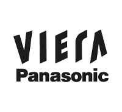

# node-panasonic-viera

[](https://github.com/jens-maus/node-panasonic-viera/actions)
[](https://www.npmjs.com/package/node-panasonic-viera)
[](https://www.npmjs.com/package/node-panasonic-viera)
[](https://github.com/jens-maus/node-panasonic-viera/blob/master/LICENSE)
[](https://www.paypal.com/cgi-bin/webscr?cmd=_s-xclick&hosted_button_id=RAQSDY9YNZVCL)
[](https://github.com/jens-maus/node-panasonic-viera/stargazers/)

[](https://nodei.co/npm/node-panasonic-viera/)

node-panasonic-viera is a NodeJS class that allows to query and control a [Panasonic Viera SmartTV](https://www.panasonic.com/de/consumer/wir-leben-technik/flachbildfernseher.html) via its official "Viera Link" Web-API. It is developed to be compatible with older and newer (2018+) devices that either accept unencrypted or encrypted communications only.

## Features
* Support for all pre and post 2018 Panasonic SmartTV devices supporting the VieraLink protocol.
* Power TV On & Off
* Input switching
* TV Apps handling

## Requirements
* Compatible Panasonic Viera SmartTV
* nodejs v12+

## Installation
node-panasonic-viera can be installed using the following npm command:

```sh
npm install node-panasonic-viera
```

## TV setup

1. On your TV go to `Menu -> Network -> TV Remote App Settings` and make sure that the following settings are **all** turned **ON**:

   - **TV Remote**
   - **Powered On by Apps**
   - **Networked Standby**

2. Then, go to `Menu -> Network -> Network Status -> Status Details` and take note of your TV ip address.

## Example
node-panasonic-viera has been designed to be used quite straight forward and without introducing
ackward language constructs. The following example should give a brief introduction on
how to use node-panasonic-viera in your own applications:

```js
import {VieraKeys, Viera} from 'node-panasonic-viera';

const viera = new Viera();

// CONNECT
viera.connect('192.168.178.140', 'JkasiKDjwuKasW==', 'J19DKDfju283jKFzlaO9za==')
  // 1. power on TV
  .then(() => {
    return viera.sendKey(VieraKeys.power);
  })
  // 2. set volume to 20
  .then(() => {
    return viera.setVolume(20);
  })
  // 3. get volume
  .then(() => {
    return viera.getVolume();
  })
  // 4. output volume level
  .then((volume) => {
    console.log(volume);
  })
  // catch errors
  .catch((error) => {
    console.log(error);
  });
```

## References
This nodejs package/class uses functionality/Know-How gathered from different third-party projects:

* [samuelmatis/viera.js](https://github.com/samuelmatis/viera.js)
* [g30r93g/viera.js](https://github.com/g30r93g/viera.js)
* [AntonioMeireles/homebridge-vieramatic](https://github.com/AntonioMeireles/homebridge-vieramatic)

## Use-Cases
The following projects are known to use this nodejs class for query/control UniFi devices:

* [ioBroker.panasonic-viera](https://github.com/iobroker-community-adapters/ioBroker.panasonic-viera)

## License
The MIT License (MIT)

Copyright (c) 2020-2021 Jens Maus &lt;mail@jens-maus.de&gt;

Permission is hereby granted, free of charge, to any person obtaining a copy
of this software and associated documentation files (the "Software"), to deal
in the Software without restriction, including without limitation the rights
to use, copy, modify, merge, publish, distribute, sublicense, and/or sell
copies of the Software, and to permit persons to whom the Software is
furnished to do so, subject to the following conditions:

The above copyright notice and this permission notice shall be included in
all copies or substantial portions of the Software.

THE SOFTWARE IS PROVIDED "AS IS", WITHOUT WARRANTY OF ANY KIND, EXPRESS OR
IMPLIED, INCLUDING BUT NOT LIMITED TO THE WARRANTIES OF MERCHANTABILITY,
FITNESS FOR A PARTICULAR PURPOSE AND NONINFRINGEMENT. IN NO EVENT SHALL THE
AUTHORS OR COPYRIGHT HOLDERS BE LIABLE FOR ANY CLAIM, DAMAGES OR OTHER
LIABILITY, WHETHER IN AN ACTION OF CONTRACT, TORT OR OTHERWISE, ARISING FROM,
OUT OF OR IN CONNECTION WITH THE SOFTWARE OR THE USE OR OTHER DEALINGS IN
THE SOFTWARE.
